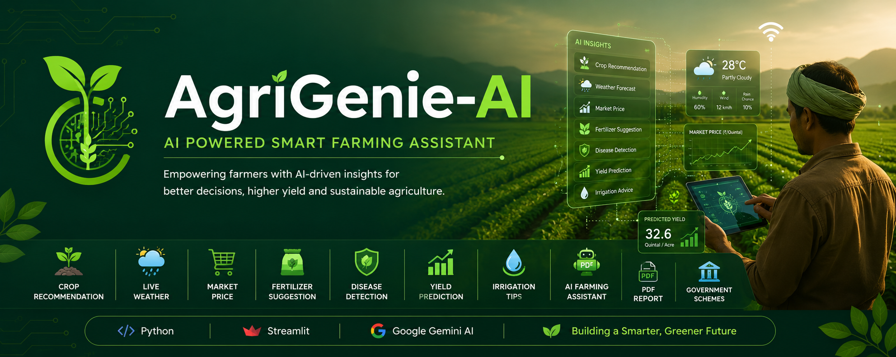

# 🌱 AgriGenie-AI

  

# 🌱 AgriGenie-AI

## AI Powered Smart Farming Assistant

AgriGenie-AI is an AI-powered smart farming assistant developed using **Python, Streamlit, and Google Gemini AI** to help farmers make better agricultural decisions.

---

## 🚀 Features

- 🌾 Crop Recommendation
- 🌦️ Live Weather Information
- 💰 Crop Market Price
- 🌱 Fertilizer Suggestion
- 🌾 AI Yield Prediction
- 💧 Irrigation Tips
- 🌿 Plant Disease Detection (Gemini AI)
- 🤖 AI Farming Assistant
- 📄 PDF Report Generation
- 🏛️ Government Schemes

---

## 🛠️ Tech Stack

- Python
- Streamlit
- Google Gemini AI
- Pandas
- Requests
- Pillow
- FPDF

---

## ▶️ Live Demo

https://agrigenie-ai-prfjqj3dh3zqppmzouzyca.streamlit.app/

---

## 👨‍💻 Developer

**M. Kesavanath**

ECE Student | AI & Embedded Systems Enthusiast

---

⭐ If you like this project, don't forget to Star this repository.
